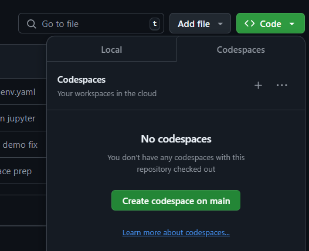
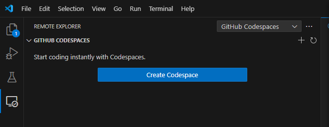

# IMD Workshop 2024

## Getting a codespace 

To get access to the workshop environment, you have two options:

### 1. In the browser

The easiest way is to simply click the "+" in the codespaces menu in this repo (shown below) to create a new codespace. A workshop environment will be created and VSCode will automatically run in your browser
with the extensions and packages you'll need already installed, including GROMACS, LAMMPS, NAMD, MDAnalysis, and IMDClient.

### 2. In your IDE

You can also use your own IDE to spin up and connect to a codespace. If you have VSCode installed, you can install the 
[codespace extension](https://marketplace.visualstudio.com/items?itemName=GitHub.codespaces). 
After installing, you'll see the "remote explorer" icon on the left. 
Click "Create Codespace" and type in "Becksteinlab/imd-workshop-2024" and select the "main" branch and a 2-core CPU.

After that, VSCode will automatically launch a new window which is executing in the codespace workshop environment.
To troubleshoot, see the documentation [here](https://docs.github.com/en/codespaces/developing-in-a-codespace/using-github-codespaces-in-visual-studio-code).

An extension is also available [for Pycharm](https://plugins.jetbrains.com/plugin/20060-github-codespaces).

## Setting up the activity notebook

First, open the "activity/activity.ipynb" jupyter notebook from this repo in your codespace environment.

Before running any code, select the "workshop" conda environment as your kernel
in the upper right corner of the jupyter notebook. You may have to restart the kernel for this to take effect.

After that, follow the instruction in the notebook to run the simulation engines and your analysis code!

