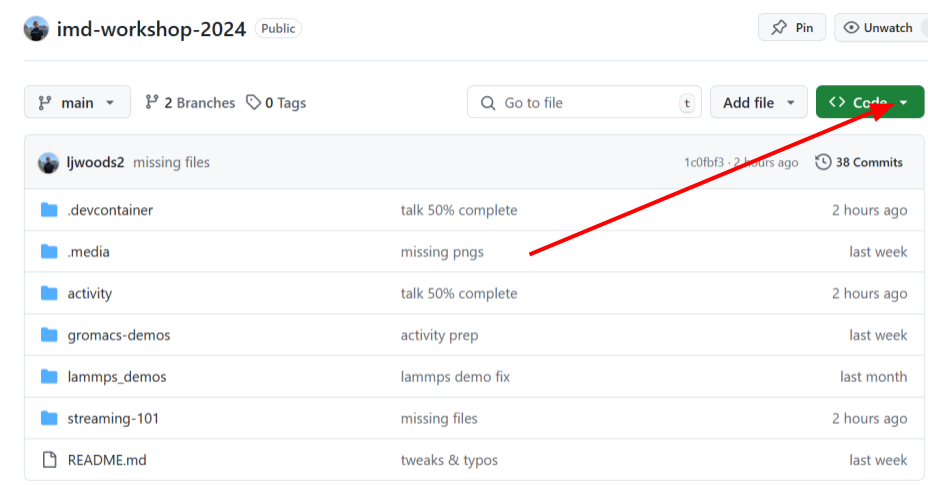
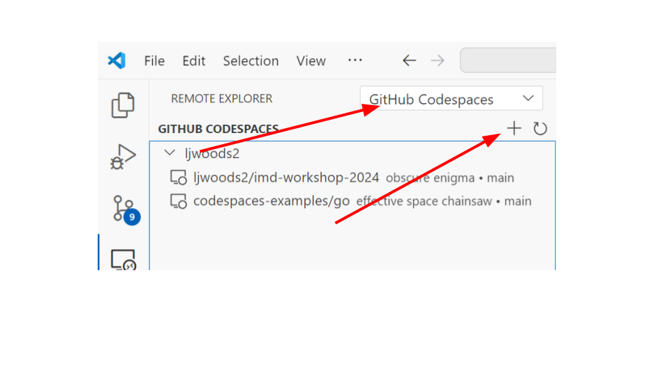

# IMD Workshop 2024

Welcome to the interactive portion of the workshop! 
To get started, we recommend using VSCode
in the browser with the Github codespace we've provided 
which includes all the tools you'll need to get started with live
simulation streaming.

# 1. Codespace environment setup

## i. Github codespaces in the browser (recommended)

The easiest way is to simply use this repository to create a codespace.
A workshop environment will be created and VSCode will automatically run in your browser.

Duplicate this tab so you will still have access
to these instructions when the codespace is launched.

Select the green "Code" button and then create a codespace:




You're done! The codespace will launch in the current tab. Move on to section 2 to get started with the activity.

## ii. Github codespaces tunnel from your IDE (VSCode and Pycharm)

You can use your own IDE to spin up and connect to a codespace (which GitHub will host). 

If you are using VSCode, follow these steps:

If you have VSCode installed, you can install the 
[codespace extension](https://marketplace.visualstudio.com/items?itemName=GitHub.codespaces). 

After installing, you'll see the "remote explorer" icon on the left.
Sign in if you aren't already.


Select the dropdown arrow to select "Github codespaces" and
then select the "+" to create a new codespace.



A dialog will appear. For the repository, enter "ljwoods2/imd-workshop-2024". For the branch, select "main"
For the machine type, select "2 cores, 8GB RAM, 32 GB storage"

After that, VSCode will automatically launch a new window which is executing in the codespace workshop environment.
To troubleshoot, see the documentation [here](https://docs.github.com/en/codespaces/developing-in-a-codespace/using-github-codespaces-in-visual-studio-code).

### Pycharm

A codespace extension is also available for [Pycharm](https://plugins.jetbrains.com/plugin/20060-github-codespaces).

## iii. Local codespace in IDE (VSCode only) (slow, not recommend)

You can also run the workshop activity locally if you have the [devcontainers VScode extension](https://marketplace.visualstudio.com/items?itemName=ms-vscode-remote.remote-containers)
and [docker](https://docs.docker.com/engine/install/) installed. 

After docker is installed & enabled and your user has been added to the docker group, run:
```bash
git clone https://github.com/ljwoods2/imd-workshop-2024.git
code imd-workshop-2024
```
In VSCode, enter CTRL+SHIFT+P and type: "Dev Containers: Open Folder in Container..." and select
the root of the cloned repo as the folder path. A new window will open which is executing 
in the workshop activity codespace.

# 2. Getting started with the activity

First, open the "activity/activity.ipynb" jupyter notebook from this repo in your codespace environment.


Before running any code, click the "Select kernel" button
in the upper right corner of the jupyter notebook. 


Select "Python environments" and then the "workshop" environment.


Now you're ready to start the activity! Follow the instructions in the notebook to complete the activity.

